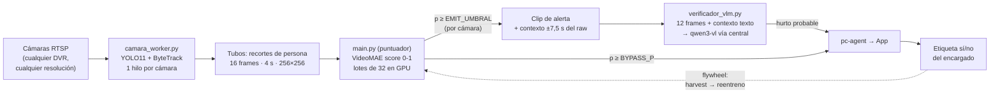

# CaptureVCOMv2

**Detección de hurto en tienda en dos etapas: clasificador de vídeo propio en el edge + verificación por VLM en la nube.**

En producción desde julio de 2026 en 3 tiendas reales (supermercado, moda y showroom en México), 17 cámaras. Sustituye a CAPTURE (el sistema anterior basado en poses): **84% de recall a falsos positivos igualados frente a ~70%**, con ~1% de FP por tienda y alertas en el móvil en ~1 minuto.

---

## Cómo funciona



1. **`camara_worker.py`** — un hilo por cámara: conecta al RTSP, graba raw continuo por segmentos (para el contexto), sigue a cada persona con YOLO11+ByteTrack y construye *tubos* (recortes normalizados de 4 s). Independiente de la cámara, marca y resolución. Fuera del horario de tienda, duerme.
2. **`main.py`** — el puntuador: recoge tubos en lotes y los puntúa con VideoMAE (`modelo.py`). La emisión pasa por un gate con umbral global **y por cámara**, re-arme por valle, cooldown de 8 s y "upgrade" por pico (ningún hurto en ráfaga se pierde, ningún gesto continuo se duplica).
3. **`verificador_vlm.py`** — segunda opinión: por cada clip emitido manda 6 frames del clip + 6 de contexto (antes/después, desde el raw) al VLM vía el servidor central, con el contexto de la tienda en texto (zona de la cámara, uniformes del personal, reglas del prompt). Solo lo confirmado llega al pc-agent → app. Scores ≥ `BYPASS_P` van directos sin esperar al VLM.
4. **Flywheel** — el encargado marca cada alerta (hurto sí/no) en la app; `training/harvest_v14.py` convierte esas etiquetas en tubos de entreno en la propia tienda, y `training/train.py` reentrena. Un ciclo completo cuesta ~1 € de GPU.

## Por qué gana a un modelo de poses

- Un esqueleto de 17 puntos no distingue "agacharse a atarse el zapato" de "agacharse a guardarse una botella": **el hurto vive en lo que la pose descarta** (la mano, el producto, la bolsa).
- Detectar "objetos de tienda" con un detector genérico (miles de referencias, a 8 m, ocultas en una mano) no es viable; nosotros usamos YOLO solo para lo que es imbatible: personas.
- No es "un modelo de colores": VideoMAE aprende patrones espacio-temporales, y el entreno **destruye el color a propósito** (jitter por canal, escala de grises) para que no se apoye en la ropa.
- La interpretabilidad la pone la segunda etapa: el VLM explica cada veredicto en lenguaje natural.
- Y lo medimos: mismos clips, cara a cara → 84% vs ~70% de recall a FP igualados.

## Estructura del repo

```
├── main.py               # puntuador + gate de emisión (umbral por cámara incluido)
├── camara_worker.py      # hilo por cámara: RTSP, raw, tracking, tubos
├── modelo.py             # carga y scoring de VideoMAE
├── verificador_vlm.py    # segunda opinión VLM + entrega al pc-agent
├── config.example.py     # ← plantilla comentada: copiar a config.py y adaptar
├── requirements.txt
├── deploy/               # units systemd + vlm.env.example
├── tools/                # inspección, prueba histórica, test de carga, envío directo
└── training/             # train.py (entreno) + harvest_v14.py (cosecha de etiquetas)
```

## Instalación en una tienda nueva (~1 hora)

Requisitos: Ubuntu 24.04, GPU NVIDIA ≥ 8 GB (probado en RTX 5060 Ti/5070 Ti), acceso RTSP a las cámaras, pc-agent instalado.

```bash
# 1. Código y entorno
sudo mkdir -p /opt/capturevcomv2 && cd /opt/capturevcomv2
git clone git@github.com:SmartVCom/CaptureVCOMv2.git .
python3 -m venv venv && venv/bin/pip install -r requirements.txt

# 2. Modelos (no van en git)
mkdir model
# → copiar el checkpoint en producción (GCS: gs://shintek-capture-v3/) como
#   model/videomae_v6_last.pt, y yolo11s.pt como model/yolo11s.pt

# 3. Configuración de la tienda
cp config.example.py config.py       # editar: cámaras, zonas, horario, personal
cp deploy/vlm.env.example vlm.env    # editar: PC_API_KEY
chmod 600 vlm.env

# 4. Servicios
sudo cp deploy/capturevcomv2.service deploy/capturevcomv2-vlm.service /etc/systemd/system/
sudo systemctl daemon-reload
sudo systemctl enable --now capturevcomv2 capturevcomv2-vlm

# 5. Verificar
journalctl -u capturevcomv2 -f     # "conectado" por cámara + "N ventanas puntuadas"
```

## Personalización por tienda (las 3 palancas)

| Capa | Dónde | Ejemplos reales |
|---|---|---|
| **Detector** | `config.py` | Quitar cámaras de cajas (ensacado legítimo ≈ hurto). `EMIT_UMBRAL_POR_CAM` para cámaras problemáticas (pantalla publicitaria en probadores → 0.45 y el 95% de los FP de la tienda desaparecieron). Coste computacional cero. |
| **VLM** | `config.py` (texto) | `ZONAS_CAMARAS` (razona distinto en "licores" que en "probadores"), `EMPLEADOS_DESC` (uniformes → descarta reponedores), `TIENDA_DESC`/`ARTICULO`. Sin reentrenar nada. |
| **Modelo** | flywheel | Las etiquetas del encargado se cosechan (`training/harvest_v14.py --excluir camX` para excluir cámaras) y entran al siguiente reentreno. La personalización manual se convierte en conocimiento aprendido. |

## Operación

- **Umbral real de emisión**: `EMIT_UMBRAL` (0.45) en `config.py`. ⚠️ `UMBRAL`/`CVC_THR` es legacy (banner y scripts offline), **no** afecta a la emisión.
- **Cambiar modelo**: sustituir `model/videomae_v6_last.pt` (swap atómico: copiar a `.tmp` + `mv`), `systemctl restart capturevcomv2 capturevcomv2-vlm`. Guardar siempre backup del anterior → rollback en 2 minutos.
- **Ningún modelo a producción sin**: (1) benchmark (hurtos reales + FP reales), y (2) validación sobre los clips de un día completo de tienda. El val-AUC in-distribution engaña — un modelo con val 1.0 llegó a multiplicar ×10 las emisiones reales.
- **Logs**: `journalctl -u capturevcomv2` (conexiones, alertas, contador de ventanas) y `-u capturevcomv2-vlm` (veredictos). Los clips llevan el score en el nombre (`p0.87`).
- **Disco**: el raw consume ~1,2 GB/h por cámara 1080p → `RETENCION_RAW_H` corto (1 h por defecto).
- **Archivo de veredictos**: `data/reentreno/<veredicto>/` guarda cada clip analizado por el VLM — es la materia prima del flywheel.

## Resultados (agosto 2026)

| Métrica | CAPTURE (poses) | CaptureVCOMv2 |
|---|---|---|
| Recall @ FP igualados (benchmark duro) | ~70% | **84%** |
| FP sobre 305 casos difíciles reales | 4-5% | **~1%** |
| Hurtos reales confirmados | — | score 0,98-0,99 |
| Clips de alerta por hora y tienda | — | ~8 (antes del ciclo de mejora: ~30) |
| Coste operativo | — | ~4 €/cámara/mes de VLM |

Metodología: benchmark de 19 hurtos reales + 305 FP reales, y validación con 1.012 clips de un día completo antes de cada despliegue.

## Entrenamiento

Ver `training/`. Flujo resumido:
1. `harvest_v14.py <DD-MM-YYYY> <out> [--solo si|no] [--excluir camX] [--tag TIENDA]` en la tienda → tubos `.npy` desde las etiquetas del cuestionario.
2. Construir índice (base + tubos nuevos; los nuevos a `train`, val/test intactos).
3. `train.py` en la VM de GPU (L4 en GCP; se enciende solo para entrenar). El **fine-tune desde el modelo en producción** (lr ~1e-5, pocas épocas) preserva lo aprendido; la selección de checkpoint se hace **por benchmark real**, no por val.
4. Validar (benchmark + día real) → desplegar con backup.

Reglas de datos: excluir clips con veredicto "empleado" (cada tienda viste distinto), cuidado con negativos fuera de distribución, datos de clientes reales solo on-premise.

## Historial de modelos

| Modelo | Nota |
|---|---|
| v13 | Base heredada (julio 2026) |
| v14-ft | Fine-tune de v13; mejor FC, más FP en AM |
| **v14-ft2** | **En producción.** Fine-tune con índice completo + refuerzo de negativos AM. rec@5%FP 0.842 |
| v14-scratch3 | Ganó el benchmark (1.000) pero ×10 emisiones reales → retirado. La lección de "validar con día real" |
| v14-large | VideoMAE-Large: empató con receta mala → tiene techo; en la recámara |

---
*SmartVCom · repo privado · los pesos de los modelos viven en GCS (`gs://shintek-capture-v3/`), nunca en git.*
